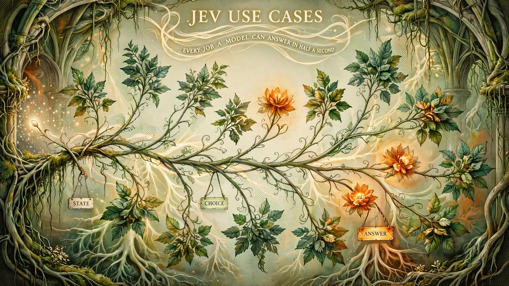

# Jev use cases

**Twenty-two jobs a decision model can take over, each with its code and its prompts.**



A language model writes an answer, and then your program has to read it, hope it is in the right shape, and cope when it is not. Jev does not write. You send it a piece of text and a set of questions whose answers you already know how to list, and it sends back one of your answers with a probability your code can test.

This site is a reference to what that is good for: twenty-two jobs, grouped by how much of your stack they touch, each one written in plain words as well as in code. The original nineteen come from one video; the rest were found in the field afterwards.

- **Live:** <https://jevusecases-production.up.railway.app>
- **Plain-language guide:** [about.html](about.html) — what Jev is, how to call it, and where it goes wrong, set for readers who find dense text hard work.
- **Source of the first nineteen jobs:** <https://youtube.com/watch?v=3iDiWTt8lok> (Jay E | RoboNuggets)
- **The later jobs:** found in the field; each case card links the article that named it.

## What is here

Every case carries the same five things:

1. **The decision** — the state it reads, the question it answers, the answer it returns.
2. **In plain words** — what comes in, what you hand over, what it does, what you get back, with green marking what you supply and orange marking what the model decides and returns.
3. **One runnable snippet** — the smallest honest version of the call.
4. **Two or three example prompts** — the state and the question, ready to paste.
5. **A drawn plate** — the decision itself as a forest: a seed of light enters, the stem splits into exactly as many vine branches as the case has candidate answers, and one branch carries the amber bloom that was chosen.

## Easy

_A single call sits in front of work you already do._

- **01. Spreadsheet data categorisation** — `00:53` · [watch at 00:53](https://youtube.com/watch?v=3iDiWTt8lok&t=53s)
- **02. Customer inquiry triage and routing** — `01:31` · [watch at 01:31](https://youtube.com/watch?v=3iDiWTt8lok&t=91s)
- **03. Competitor advertisement intelligence** — `02:35` · [watch at 02:35](https://youtube.com/watch?v=3iDiWTt8lok&t=155s)
- **04. Clip extraction from long recordings** — `03:09` · [watch at 03:09](https://youtube.com/watch?v=3iDiWTt8lok&t=189s)
- **05. Churn risk profiling** — `03:37` · [watch at 03:37](https://youtube.com/watch?v=3iDiWTt8lok&t=217s)
- **06. Internal linking and knowledge base graphing** — `04:03` · [watch at 04:03](https://youtube.com/watch?v=3iDiWTt8lok&t=243s)
- **07. Social purchase intent** — `04:38` · [watch at 04:38](https://youtube.com/watch?v=3iDiWTt8lok&t=278s)
- **08. Output verification and model calibration** — `05:04` · [watch at 05:04](https://youtube.com/watch?v=3iDiWTt8lok&t=304s)
- **22. Scheduled Run Wake Check** — [OneClickClaw news](https://oneclickclaw.io/news/jev-hermes-agent-owners-8-jobs)

## Intermediate

_A queue, an index, or a small service appears._

- **09. Agent skill selection** — `06:21` · [watch at 06:21](https://youtube.com/watch?v=3iDiWTt8lok&t=381s)
- **10. Intelligent multi model routing** — `07:02` · [watch at 07:02](https://youtube.com/watch?v=3iDiWTt8lok&t=422s)
- **11. Inbox pre filtering for AI agents** — `07:37` · [watch at 07:37](https://youtube.com/watch?v=3iDiWTt8lok&t=457s)
- **12. Browser feed cleansing and element removal** — `08:07` · [watch at 08:07](https://youtube.com/watch?v=3iDiWTt8lok&t=487s)
- **13. Semantic in page search** — `08:39` · [watch at 08:39](https://youtube.com/watch?v=3iDiWTt8lok&t=519s)
- **14. Image and asset retrieval via metadata** — `09:13` · [watch at 09:13](https://youtube.com/watch?v=3iDiWTt8lok&t=553s)
- **20. Claim and Source Support Check** — [matthiasfrank.de](https://matthiasfrank.de/en/jev-ai-use-cases/)
- **21. Retrieval Stopping Decision** — [Lyzr](https://www.lyzr.ai/blog/jev-as-an-ai-router-and-controller/)

## Advanced

_A part of your stack starts making its own choices._

- **15. Live meeting and speech classification** — `10:00` · [watch at 10:00](https://youtube.com/watch?v=3iDiWTt8lok&t=600s)
- **16. Zero LLM retrieval engine** — `10:30` · [watch at 10:30](https://youtube.com/watch?v=3iDiWTt8lok&t=630s)
- **17. Dynamic UI icon selection** — `11:13` · [watch at 11:13](https://youtube.com/watch?v=3iDiWTt8lok&t=673s)
- **18. Just in time page assembly** — `11:59` · [watch at 11:59](https://youtube.com/watch?v=3iDiWTt8lok&t=719s)
- **19. Workflow use case auditing** — `12:23` · [watch at 12:23](https://youtube.com/watch?v=3iDiWTt8lok&t=743s)

## How the page is made

| Piece | Tool |
| --- | --- |
| Scroll engine | `scrollcraft` (pinned, panning and flowing acts) |
| Page build | `scripts/build_page.py` — reads `content.json`, writes `index.html` |
| Plain-language guide | `scripts/build_about.py` — writes `about.html` |
| Artwork | `scripts/forest_art.py` and `scripts/forest_art_text.py`, drawn with `muse-image` on the Venice API |
| Plate pipeline | `scripts/forest_plates.py` — resize, feather the edges onto real transparency, write webp |
| This readme | `scripts/build_readme.py` — generated from `content.json` |

The plates are feathered rather than framed: a generated picture has a hard rectangular edge baked into its pixels, so each one is masked onto a transparent background. Without that it reads as a rectangle pasted on the paper, whatever the CSS blend does.

## Run it locally

```bash
python3 scripts/build_page.py      # data -> index.html
python3 scripts/build_about.py     # -> about.html
python3 scripts/build_readme.py    # -> README.md
python3 -m http.server 4500 --bind 127.0.0.1
```

Drawing new art needs a Venice API key in `HERMES_CUSTOM_API_VENICE_AI_API_KEY`. Nothing else in the build touches the network.

## Adding a case

This site is meant to grow, so adding a case is a data edit, not a code change. Add an object to `content.json` with `n`, `title`, `tier`, `at`, `what`, `shape`, `use`, `code`, `prompts`, `caption`, `plain` and `plate`, then:

```bash
python3 scripts/forest_art_text.py NN   # draw its plate
python3 scripts/forest_plates.py        # feather and compress every plate
python3 scripts/build_page.py           # rebuild the page
python3 scripts/build_readme.py         # keep this file true
```

The tier headings on the page ("Cases 01 to 08") are computed from the case numbers in each tier, so no count is ever baked into a title.

## About the words in the pictures

The plates carry hand-painted lettering. A drawing model mangles a few letters, and that is accepted here on purpose: the picture is atmosphere, and the real labels live in the page's own type, where they are selectable, searchable and readable by a screen reader.

## Credits

The nineteen jobs come from [Jay E | RoboNuggets](https://youtube.com/watch?v=3iDiWTt8lok). Jev itself is made by [TypeSafe AI](https://typesafe.ai); the plain-language guide cites the maker's documentation alongside independent notes and worked implementations. This site is an independent reference and is not affiliated with TypeSafe.
